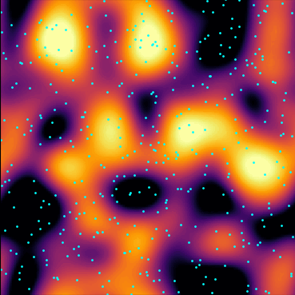
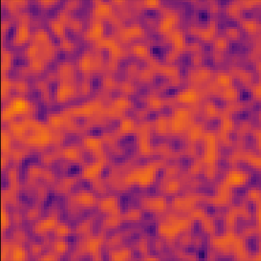
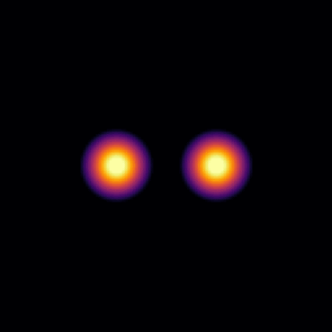
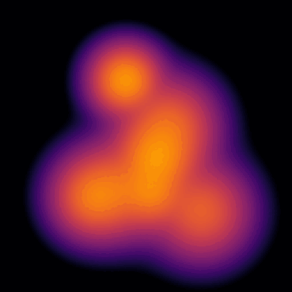
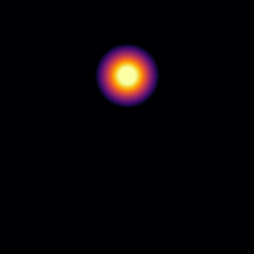
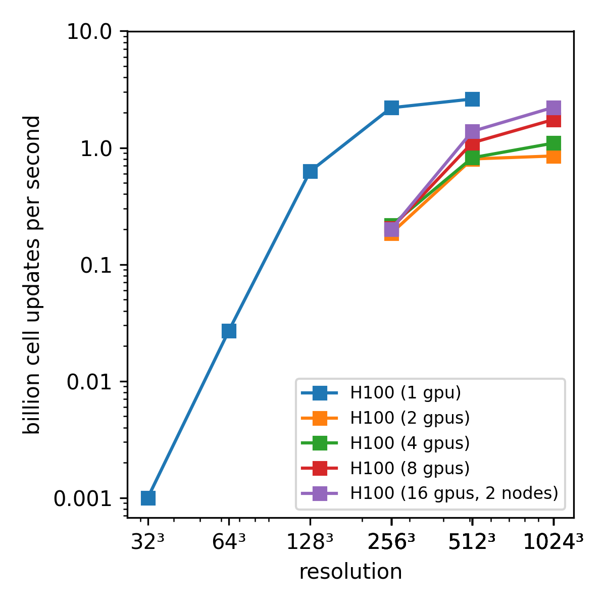

<p align="center">
  <a href="https://jaxion.readthedocs.io">
    
  </a>
</p>

# jaxion

[![Repo Status][status-badge]][status-link]
[![PyPI Version Status][pypi-badge]][pypi-link]
[![Test Status][workflow-test-badge]][workflow-test-link]
[![Coverage][coverage-badge]][coverage-link]
[![Ruff][ruff-badge]][ruff-link]
[![asv][asv-badge]][asv-link]
[![Readthedocs Status][docs-badge]][docs-link]
[![License][license-badge]][license-link]
[![Software DOI][software-doi-badge]][software-doi-link]
[![JOSS DOI][joss-doi-badge]][joss-doi-link]

[status-link]:         https://www.repostatus.org/#active
[status-badge]:        https://www.repostatus.org/badges/latest/active.svg
[pypi-link]:           https://pypi.org/project/jaxion
[pypi-badge]:          https://img.shields.io/pypi/v/jaxion?label=PyPI&logo=pypi
[workflow-test-link]:  https://github.com/JaxionProject/jaxion/actions/workflows/test-package.yml
[workflow-test-badge]: https://github.com/JaxionProject/jaxion/actions/workflows/test-package.yml/badge.svg?event=push
[coverage-link]:       https://app.codecov.io/gh/JaxionProject/jaxion
[coverage-badge]:      https://codecov.io/github/jaxionproject/jaxion/graph/jaxion-server/badge.svg
[ruff-link]:           https://github.com/astral-sh/ruff
[ruff-badge]:          https://img.shields.io/endpoint?url=https://raw.githubusercontent.com/astral-sh/ruff/main/assets/badge/v2.json
[asv-link]:            https://jaxionproject.github.io/jaxion-benchmarks/
[asv-badge]:           https://img.shields.io/badge/benchmarked%20by-asv-blue.svg?style=flat
[docs-link]:           https://jaxion.readthedocs.io
[docs-badge]:          https://readthedocs.org/projects/jaxion/badge
[license-link]:        https://opensource.org/licenses/Apache-2.0
[license-badge]:       https://img.shields.io/badge/License-Apache_2.0-blue.svg
[software-doi-link]:   https://doi.org/10.5281/zenodo.17438467
[software-doi-badge]:  https://zenodo.org/badge/1072645376.svg
[joss-doi-link]:       https://doi.org/10.21105/joss.09542
[joss-doi-badge]:      https://joss.theoj.org/papers/10.21105/joss.09542/status.svg


A simple JAX-powered simulation library for numerical experiments of fuzzy dark matter, stars, gas + more!

Author: [Philip Mocz (@pmocz)](https://github.com/pmocz/)

Jaxion is built for multi-GPU scalability and is fully differentiable. It is a high-performance JAX-based simulation library for modeling fuzzy dark matter alongside stars, gas, and cosmological dynamics. Being differentiable, Jaxion can seamlessly integrate with pipelines for inverse-problems, inference, optimization, and coupling to ML models.

Jaxion is the simpler companion project to differentiable astrophysics code [Adirondax](https://github.com/AdirondaxProject/adirondax)


## Install Jaxion

Install with:

```console
pip install jaxion
```

or see the docs for how to [build from source](https://jaxion.readthedocs.io/en/latest/pages/installation.html).


## Examples

Check out the [`examples/`](https://github.com/JaxionProject/jaxion/tree/main/examples/) directory for demonstrations of using Jaxion.

<p align="center">
  <a href="https://github.com/JaxionProject/jaxion/tree/main/examples/cosmological_box">
    
  </a>
  <a href="https://github.com/JaxionProject/jaxion/tree/main/examples/dynamical_friction">
    
  </a>
  <a href="https://github.com/JaxionProject/jaxion/tree/main/examples/heating_gas">
    
  </a>
  <br>
  <a href="https://github.com/JaxionProject/jaxion/tree/main/examples/heating_stars">
    
  </a>
  <a href="https://github.com/JaxionProject/jaxion/tree/main/examples/kinetic_condensation">
    
  </a>
  <a href="https://github.com/JaxionProject/jaxion/tree/main/examples/logo_inverse_problem">
    
  </a>
  <br>
  <a href="https://github.com/JaxionProject/jaxion/tree/main/examples/soliton_binary_merger">
    
  </a>
  <a href="https://github.com/JaxionProject/jaxion/tree/main/examples/soliton_merger">
    
  </a>
  <a href="https://github.com/JaxionProject/jaxion/tree/main/examples/tidal_stripping">
    
  </a>
</p>


## Try it out!

Launch a live demo in Google Colab: [](https://colab.research.google.com/github/JaxionProject/jaxion/blob/main/notebooks/soliton_binary_merger/soliton_binary_merger.ipynb)


## High-Performance

Jaxion is scalable on multiple GPUs!

<p align="center">
  <a href="https://jaxion.readthedocs.io">
    
  </a>
</p>


## Contributing

Jaxion welcomes community contributions of all kinds. Open an issue or fork the code and submit a pull request. Please check out the [Contributing Guidelines](CONTRIBUTING.md)


## TODO/Wishlist

* cosmological initial condition generator
* add cosmological factors to gas evolution


## Links

* [Code repository](https://github.com/JaxionProject/jaxion) on GitHub (this page).
* [Documentation](https://jaxion.readthedocs.io) for up-to-date information about installing and using Jaxion.


## Cite this repository

If you use this software, please cite it as below.

```bibtex
@software{Mocz_Jaxion_2025,
   author = {Mocz, Philip},
      doi = {10.5281/zenodo.17438467},
    month = apr,
    title = {{Jaxion}},
      url = {https://github.com/JaxionProject/jaxion},
  version = {0.0.11},
     year = {2026}
}
```
