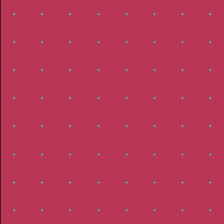

Examples
========

The `examples/ <https://github.com/JaxionProject/jaxion/tree/main/examples>`_ directory contains a collection of astrophysics simulations demonstrating various applications of the Jaxion library.

Gallery
-------

.. list-table::
   :widths: 32 32 32
   :header-rows: 0

   * - .. figure:: ../../examples/cosmological_box/movie.gif
         :width: 300px
         :align: center
         :alt: cosmological box
         :target: examples.html#cosmological-box

     - .. figure:: ../../examples/dynamical_friction/movie.gif
         :width: 300px
         :align: center
         :alt: dynamical friction
         :target: examples.html#dynamical-friction

     - .. figure:: ../../examples/heating_gas/movie.gif
         :width: 300px
         :align: center
         :alt: heating gas
         :target: examples.html#heating-gas

   * - .. figure:: ../../examples/heating_stars/movie.gif
         :width: 300px
         :align: center
         :alt: heating stars
         :target: examples.html#heating-stars

     - .. figure:: ../../examples/kinetic_condensation/movie.gif
         :width: 300px
         :align: center
         :alt: kinetic condensation
         :target: examples.html#kinetic-condensation

     - .. figure:: ../../examples/logo/movie.gif
         :width: 300px
         :align: center
         :alt: logo
         :target: examples.html#logo

   * - .. figure:: ../../examples/soliton_binary_merger/movie.gif
         :width: 300px
         :align: center
         :alt: soliton binary merger
         :target: examples.html#soliton-binary-merger

     - .. figure:: ../../examples/soliton_merger/movie.gif
         :width: 300px
         :align: center
         :alt: soliton merger
         :target: examples.html#soliton-merger

     - .. figure:: ../../examples/tidal_stripping/movie.gif
         :width: 300px
         :align: center
         :alt: tidal stripping
         :target: examples.html#tidal-stripping

cosmological_box
----------------

.. figure:: ../../examples/cosmological_box/movie.gif
  :width: 300px
  :align: center
  :alt: cosmological box
  :target: examples.html#cosmological-box

README:

.. literalinclude:: ../../examples/cosmological_box/README.md
  :language: md

Script:

.. literalinclude:: ../../examples/cosmological_box/cosmological_box.py
  :language: python

dynamical_friction
------------------

.. figure:: ../../examples/dynamical_friction/movie.gif
  :width: 300px
  :align: center
  :alt: dynamical friction
  :target: examples.html#dynamical-friction

README:

.. literalinclude:: ../../examples/dynamical_friction/README.md
  :language: md

Script:

.. literalinclude:: ../../examples/dynamical_friction/dynamical_friction.py
  :language: python

heating_gas
-----------

.. figure:: ../../examples/heating_gas/movie.gif
  :width: 300px
  :align: center
  :alt: heating gas
  :target: examples.html#heating-gas

README:

.. literalinclude:: ../../examples/heating_gas/README.md
  :language: md

Script:

.. literalinclude:: ../../examples/heating_gas/heating_gas.py
  :language: python

heating_stars
-------------

.. figure:: ../../examples/heating_stars/movie.gif
  :width: 300px
  :align: center
  :alt: heating stars
  :target: examples.html#heating-stars

README:

.. literalinclude:: ../../examples/heating_stars/README.md
  :language: md

Script:

.. literalinclude:: ../../examples/heating_stars/heating_stars.py
  :language: python

kinetic_condensation
--------------------

.. figure:: ../../examples/kinetic_condensation/movie.gif
  :width: 300px
  :align: center
  :alt: kinetic condensation
  :target: examples.html#kinetic-condensation

README:

.. literalinclude:: ../../examples/kinetic_condensation/README.md
  :language: md

Script:

.. literalinclude:: ../../examples/kinetic_condensation/kinetic_condensation.py
  :language: python

logo
----

README:

.. literalinclude:: ../../examples/logo/README.md
  :language: md

Script:

.. literalinclude:: ../../examples/logo/logo.py
  :language: python

soliton_binary_merger
---------------------

.. figure:: ../../examples/soliton_binary_merger/movie.gif
  :width: 300px
  :align: center
  :alt: soliton binary merger
  :target: examples.html#soliton-binary-merger

README:

.. literalinclude:: ../../examples/soliton_binary_merger/README.md
  :language: md

Script:

.. literalinclude:: ../../examples/soliton_binary_merger/soliton_binary_merger.py
  :language: python

soliton_merger
--------------

.. figure:: ../../examples/soliton_merger/movie.gif
  :width: 300px
  :align: center
  :alt: soliton merger
  :target: examples.html#soliton-merger

README:

.. literalinclude:: ../../examples/soliton_merger/README.md
  :language: md

Script:

.. literalinclude:: ../../examples/soliton_merger/soliton_merger.py
  :language: python

tidal_stripping
---------------

.. figure:: ../../examples/tidal_stripping/movie.gif
  :width: 300px
  :align: center
  :alt: tidal stripping
  :target: examples.html#tidal-stripping

README:

.. literalinclude:: ../../examples/tidal_stripping/README.md
  :language: md

Script:

.. literalinclude:: ../../examples/tidal_stripping/tidal_stripping.py
  :language: python
