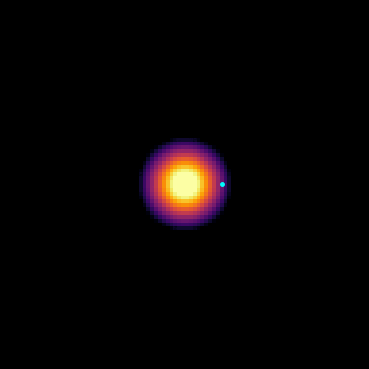

Examples
========

The `examples/ <https://github.com/JaxionProject/jaxion/tree/main/examples>`_ directory contains a collection of astrophysics simulations demonstrating various applications of the Jaxion library.

Gallery
-------

.. list-table::
   :widths: 32 32 32
   :header-rows: 0

   * - .. figure:: ../../examples/cosmological_box/movie.gif
         :width: 300px
         :align: center
         :alt: cosmological_box
         :target: examples.html#cosmological-box

     - .. figure:: ../../examples/dynamical_friction/movie.gif
         :width: 300px
         :align: center
         :alt: dynamical_friction
         :target: examples.html#dynamical-friction

     - .. figure:: ../../examples/heating_gas/movie.gif
         :width: 300px
         :align: center
         :alt: heating_gas
         :target: examples.html#heating-gas

   * - .. figure:: ../../examples/heating_stars/movie.gif
         :width: 300px
         :align: center
         :alt: heating_stars
         :target: examples.html#heating-stars

     - .. figure:: ../../examples/kinetic_condensation/movie.gif
         :width: 300px
         :align: center
         :alt: kinetic_condensation
         :target: examples.html#kinetic-condensation

     - .. figure:: ../../examples/logo_inverse_problem/movie.gif
         :width: 300px
         :align: center
         :alt: logo_inverse_problem
         :target: examples.html#logo-inverse-problem

   * - .. figure:: ../../examples/soliton_binary_merger/movie.gif
         :width: 300px
         :align: center
         :alt: soliton_binary_merger
         :target: examples.html#soliton-binary-merger

     - .. figure:: ../../examples/soliton_merger/movie.gif
         :width: 300px
         :align: center
         :alt: soliton_merger
         :target: examples.html#soliton-merger

     - .. figure:: ../../examples/tidal_stripping/movie.gif
         :width: 300px
         :align: center
         :alt: tidal_stripping
         :target: examples.html#tidal-stripping

cosmological_box
----------------

.. figure:: ../../examples/cosmological_box/movie.gif
  :width: 300px
  :align: center
  :alt: cosmological box
  :target: examples.html#cosmological-box

  See on GitHub: `examples/cosmological_box <https://github.com/JaxionProject/jaxion/tree/main/examples/cosmological_box>`_

README:

.. literalinclude:: ../../examples/cosmological_box/README.md
  :language: md

Script:

.. literalinclude:: ../../examples/cosmological_box/cosmological_box.py
  :language: python

dynamical_friction
------------------

.. figure:: ../../examples/dynamical_friction/movie.gif
  :width: 300px
  :align: center
  :alt: dynamical friction
  :target: examples.html#dynamical-friction

  See on GitHub: `examples/dynamical_friction <https://github.com/JaxionProject/jaxion/tree/main/examples/dynamical_friction>`_

README:

.. literalinclude:: ../../examples/dynamical_friction/README.md
  :language: md

Script:

.. literalinclude:: ../../examples/dynamical_friction/dynamical_friction.py
  :language: python

heating_gas
-----------

.. figure:: ../../examples/heating_gas/movie.gif
  :width: 300px
  :align: center
  :alt: heating gas
  :target: examples.html#heating-gas

  See on GitHub: `examples/heating_gas <https://github.com/JaxionProject/jaxion/tree/main/examples/heating_gas>`_

README:

.. literalinclude:: ../../examples/heating_gas/README.md
  :language: md

Script:

.. literalinclude:: ../../examples/heating_gas/heating_gas.py
  :language: python

heating_stars
-------------

.. figure:: ../../examples/heating_stars/movie.gif
  :width: 300px
  :align: center
  :alt: heating stars
  :target: examples.html#heating-stars

  See on GitHub: `examples/heating_stars <https://github.com/JaxionProject/jaxion/tree/main/examples/heating_stars>`_

README:

.. literalinclude:: ../../examples/heating_stars/README.md
  :language: md

Script:

.. literalinclude:: ../../examples/heating_stars/heating_stars.py
  :language: python

kinetic_condensation
--------------------

.. figure:: ../../examples/kinetic_condensation/movie.gif
  :width: 300px
  :align: center
  :alt: kinetic condensation
  :target: examples.html#kinetic-condensation

  See on GitHub: `examples/kinetic_condensation <https://github.com/JaxionProject/jaxion/tree/main/examples/kinetic_condensation>`_

README:

.. literalinclude:: ../../examples/kinetic_condensation/README.md
  :language: md

Script:

.. literalinclude:: ../../examples/kinetic_condensation/kinetic_condensation.py
  :language: python

logo_inverse_problem
--------------------

.. figure:: ../../examples/logo_inverse_problem/movie.gif
  :width: 300px
  :align: center
  :alt: logo_inverse_problem
  :target: examples.html#logo_inverse_problem

  See on GitHub: `examples/logo_inverse_problem <https://github.com/JaxionProject/jaxion/tree/main/examples/logo_inverse_problem>`_

README:

.. literalinclude:: ../../examples/logo_inverse_problem/README.md
  :language: md

Script:

.. literalinclude:: ../../examples/logo_inverse_problem/logo_inverse_problem.py
  :language: python

soliton_binary_merger
---------------------

.. figure:: ../../examples/soliton_binary_merger/movie.gif
  :width: 300px
  :align: center
  :alt: soliton binary merger
  :target: examples.html#soliton-binary-merger

  See on GitHub: `examples/soliton_binary_merger <https://github.com/JaxionProject/jaxion/tree/main/examples/soliton_binary_merger>`_

README:

.. literalinclude:: ../../examples/soliton_binary_merger/README.md
  :language: md

Script:

.. literalinclude:: ../../examples/soliton_binary_merger/soliton_binary_merger.py
  :language: python

soliton_gas_star
----------------

  See on GitHub: `examples/soliton_gas_star <https://github.com/JaxionProject/jaxion/tree/main/examples/soliton_gas_star>`_

README:

.. literalinclude:: ../../examples/soliton_gas_star/README.md
  :language: md

Script:

.. literalinclude:: ../../examples/soliton_gas_star/soliton_gas_star.py
  :language: python

soliton_merger
--------------

.. figure:: ../../examples/soliton_merger/movie.gif
  :width: 300px
  :align: center
  :alt: soliton merger
  :target: examples.html#soliton-merger

  See on GitHub: `examples/soliton_merger <https://github.com/JaxionProject/jaxion/tree/main/examples/soliton_merger>`_

README:

.. literalinclude:: ../../examples/soliton_merger/README.md
  :language: md

Script:

.. literalinclude:: ../../examples/soliton_merger/soliton_merger.py
  :language: python

tidal_stripping
---------------

.. figure:: ../../examples/tidal_stripping/movie.gif
  :width: 300px
  :align: center
  :alt: tidal stripping
  :target: examples.html#tidal-stripping

  See on GitHub: `examples/tidal_stripping <https://github.com/JaxionProject/jaxion/tree/main/examples/tidal_stripping>`_

README:

.. literalinclude:: ../../examples/tidal_stripping/README.md
  :language: md

Script:

.. literalinclude:: ../../examples/tidal_stripping/tidal_stripping.py
  :language: python

timing
------

.. figure:: ../../examples/timing/timing.png
  :width: 300px
  :align: center
  :alt: timing
  :target: examples.html#timing

  See on GitHub: `examples/timing <https://github.com/JaxionProject/jaxion/tree/main/examples/timing>`_

README:

.. literalinclude:: ../../examples/timing/README.md
  :language: md

Script:

.. literalinclude:: ../../examples/timing/timing.py
  :language: python
