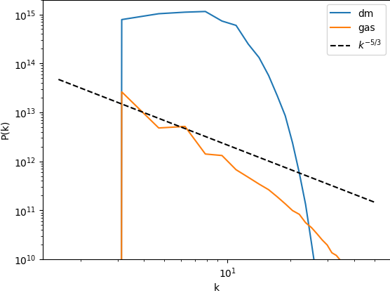

Tutorial 2: Analysis
====================

A simulation checkpoint file may be loaded for analysis and visualization.

To load the last checkpoint from a simulation, specify the checkpoint directory
when creating the ``Simulation`` object:

.. code-block:: python

    import jaxion

    # load the simulation
    sim = jaxion.Simulation("checkpoints/")

Or, to load a specific checkpoint, specify the checkpoint directory and checkpoint number:

.. code-block:: python

    sim = jaxion.Simulation("checkpoints/", checkpoint_number=i)

Once the simulation is loaded, the fields can be accessed from the ``sim.state`` object.

Jaxion also provides built-in functions to help with analysis and post-processing.

For example, to compute the radially averaged power spectrum of the fuzzy dark matter density field, do:

.. code-block:: python

    rho_dm = jnp.abs(sim.state["psi"]) ** 2
    box_size = sim.box_size
    kx, ky, kz = sim.kgrid
    Pf_dm, k, _ = jaxion.radial_power_spectrum(rho_dm, kx, ky, kz, box_size)

As an example, see `examples/heating_gas <https://github.com/JaxionProject/jaxion/tree/main/examples/heating_gas>`_
which has an ``analyze.py`` script that creates the power spectrum plot shown below:

for the simulation of gas heating by fuzzy dark matter substructure:

.. figure:: ../../examples/heating_gas/movie.gif
  :width: 300px
  :align: center
  :alt: heating_gas
