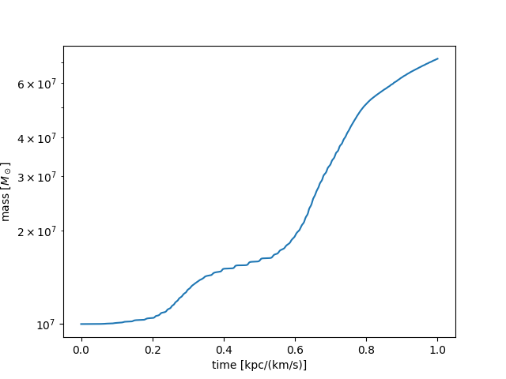

Tutorial 4: Custom Callbacks
============================

This tutorial describes how to create custom callbacks in Jaxion simulations.
The callback function is called at each time step during the simulation.
It can be used to perform custom calculations or save info on the simulation state at each step.

An example of a custom callback is provided in `examples/black_hole_accretion <https://github.com/JaxionProject/jaxion/tree/main/examples/black_hole_accretion>`_
where the callback is used to save the mass of a black hole at each time step.

It is simply done by creating new simulation state variables and defining a callback function:

.. code-block:: python

    # add callback to record info about state
    n_buffer = sim.nt + 1
    sim.state["tt"] = jnp.full((n_buffer,), jnp.nan)
    sim.state["m_bh"] = jnp.full((n_buffer,), jnp.nan)
    sim.state["tt"] = sim.state["tt"].at[0].set(0.0)
    sim.state["m_bh"] = sim.state["m_bh"].at[0].set(M_bh)
    sim.callback = callback

    def callback(i, state):
        # record the black hole mass at end of timestep i
        state["tt"] = state["tt"].at[i + 1].set(state["t"])
        state["m_bh"] = state["m_bh"].at[i + 1].set(state["mass"][0])
        return state

The callback function takes two arguments:
- `i`: the current time step index
- `state`: the current simulation state
The function should return the updated state.

In this example, the black hole mass looks something like this:

