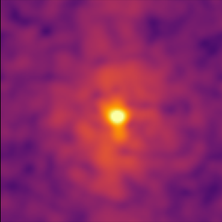
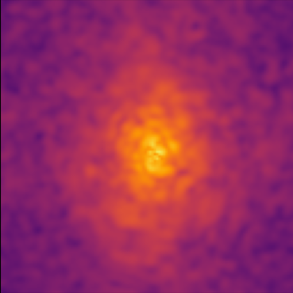

Tutorial 5: Custom Fields
=========================

This tutorial describes how to create custom quantum dark matter fields in Jaxion simulations.
An example is provided in `examples/two_field <https://github.com/JaxionProject/jaxion/tree/main/examples/two_field>`_

First, ``params["physics"]["quantum"]`` should be set to ``False`` since we will be adding out own fields.

For example, to create a two-field simulation, we can add the simulation states:
``sim.state["psi1"]`` and ``sim.state["psi2"]``.

Then, we need to define custom kick, drift, and total density functions, and attach them to the simulation object:

.. code-block:: python

    def custom_density(state):
        return jnp.abs(state["psi1"]) ** 2 + jnp.abs(state["psi2"]) ** 2

    def custom_kick(state, V, dt):
        state["psi1"] = jnp.exp(-1j * m1_per_hbar * dt * V) * state["psi1"]
        state["psi2"] = jnp.exp(-1j * m2_per_hbar * dt * V) * state["psi2"]

        return state

    def custom_drift(state, k_sq, dt):
        psi1_hat = jd.fft.pfft3d(state["psi1"])
        psi1_hat = jnp.exp(dt * (-1.0j * k_sq / m1_per_hbar / 2.0)) * psi1_hat
        state["psi1"] = jd.fft.pifft3d(psi1_hat)

        psi2_hat = jd.fft.pfft3d(state["psi2"])
        psi2_hat = jnp.exp(dt * (-1.0j * k_sq / m2_per_hbar / 2.0)) * psi2_hat
        state["psi2"] = jd.fft.pifft3d(psi2_hat)

        return state

    sim.custom_density = custom_density
    sim.custom_kick = custom_kick
    sim.custom_drift = custom_drift

In this example, the custom density function is used to compute the total density from both fields.
The custom kick and drift functions are used to update the fields during the simulation.

The simulation can then be run as usual with ``sim.run()``.

It is also possible to add custom plotting for these fields by defining a custom plotting function and attaching it to the simulation object:
``custom_plot(state, checkpoint_dir, i, params)``.

The Two-Field example evolves two quantum fields with different masses that interact gravitationally, and looks something like this:

