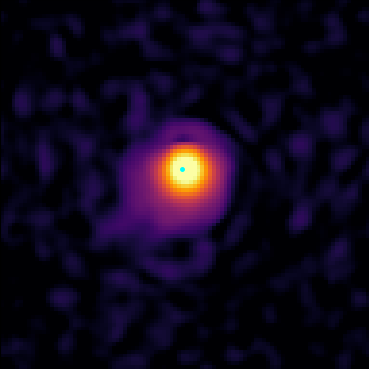

# Black Hole Accretion

Accrete gas onto a black hole particle

Philip Mocz (2025)

Usage:

```console
python black_hole_accretion.py --res <resolution_multiplier>
```

Takes around 20 (res=1) seconds to run on my macbook (cpu).


## Simulation snapshots

<div style="display:flex;flex-wrap:wrap;gap:8px">
  
  
</div>


## References


