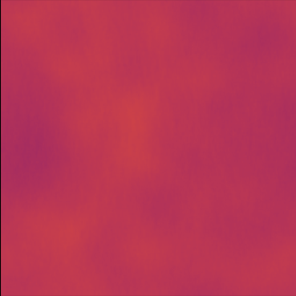
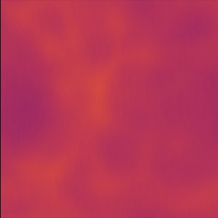
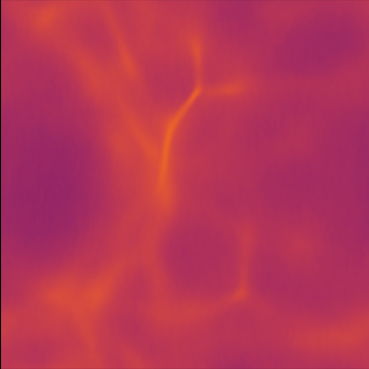
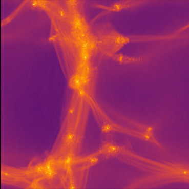

# Cosmological Box

Fuzzy Dark Matter cosmological box

Philip Mocz (2025)

Usage:

```console
python cosmological_box.py
```

Takes around 870 seconds to run on my macbook (cpu).


## Simulation snapshots

<div style="display:flex;flex-wrap:wrap;gap:8px">
  
  
  
  
  
  
</div>


## Reference

[Mocz, P. et. al.; Galaxy formation with BECDM - II. Cosmic filaments and first galaxies. MNRAS (2020)](https://ui.adsabs.harvard.edu/abs/2020MNRAS.494.2027M)
