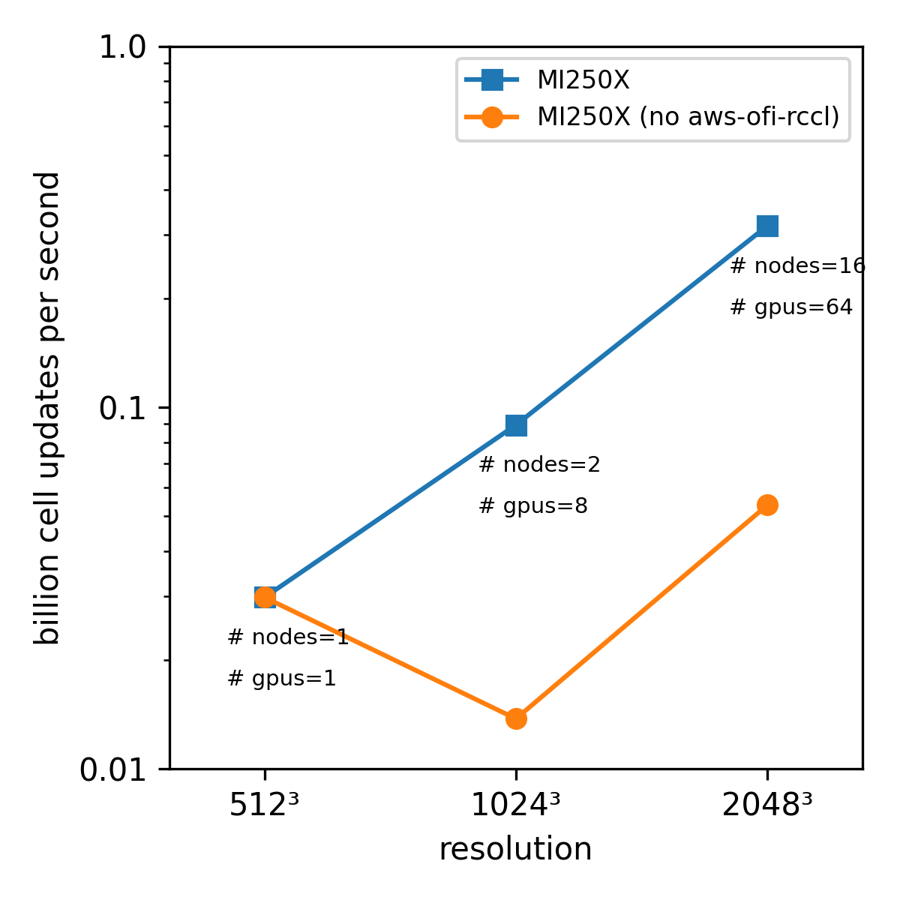

# Debug

Reproducer to setup/debug large runs on Frontier

Philip Mocz (2025)


## Install Jaxion on Frontier

1. Clone the repo:

```console
git clone git@github.com:JaxionProject/jaxion.git
```

2. Set up virtual environment (sets up conda-env jaxion-venv, installs jaxion -- see: https://docs.olcf.ornl.gov/software/analytics/jax.html):

```console
cd jaxion
./scripts/setup_venv_on_frontier.sh
```

3. (Optional, Recommended): Install the AWS-OFI-RCCL Plugin to improve performance on AMD GPUs -- see: https://docs.olcf.ornl.gov/software/analytics/pytorch_frontier.html#aws-ofi-rccl-plugin

```console
./scripts/setup_aws-ofi-rccl_on_frontier.sh
```

## Submit jobs

Examples to use for testing/debugging are in the `examples/debug/` folder:

```console
cd examples/debug
```

### Submit a Large (L) job (resolution 2048^3) on 16 nodes / 64 GPUs:

```console
sbatch sbatch_frontier_L.sh
```

This test takes around **[160 / 27]** seconds **(without/with `aws-ofi-rccl`)**.


### Submit an Extra Large (XL) job (resolution 4096^3) on 64 nodes / 512 GPUs:

```console
sbatch sbatch_frontier_XL.sh
```

This test currently fails immediately with:

```console
E1105 14:17:03.123606  763404 pjrt_stream_executor_client.cc:3045] Execution of replica 0 failed: INVALID_ARGUMENT: CliqueIds size must be 1 for NCCL communicator initialization
```

### Submit a Small (S) job (resolution 512^3) on 1 nodes / 1 GPU:

```console
sbatch sbatch_frontier_S.sh
```

which takes around **[4.5 / 4.5]** seconds to complete.


### Submit a Medium (M) job (resolution 1024^3) on 2 nodes / 8 GPUs:

```console
sbatch sbatch_frontier_M.sh
```

which takes around **[78 / 12]** seconds to complete.


## Notes

* May want to check out the install script `scripts/setup_venv_on_frontier.sh` for improved/more up-to-date ways to install JAX on Frontier.

* May want to check out the submit scripts `examples/debug/sbatch_frontier_XL.sh` for missing flags/environment variables.

* May need to update, in the slurm submit scripts, the project allocation number (e.g., `#SBATCH -A AST231`) and the path to `aws-ofi-rccl` (e.g., `export LD_LIBRARY_PATH=/lustre/orion/ast231/scratch/pmocz/aws-ofi-rccl/lib:$LD_LIBRARY_PATH`).


## Scaling


