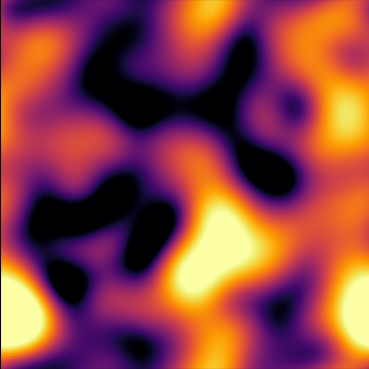

# Heating Gas

Heating Gas due to Fuzzy Dark Matter fluctuations

Philip Mocz (2025)

Usage:

```console
python heating_gas.py --res <resolution_multiplier>
```

Takes around 37 (res=1) seconds to run on my macbook (cpu).


## Simulation snapshots

Snapshots from the run:

<div style="display:flex;flex-wrap:wrap;gap:8px">
  
  
</div>
