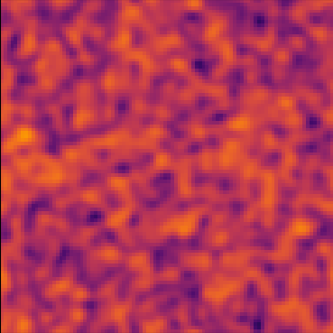
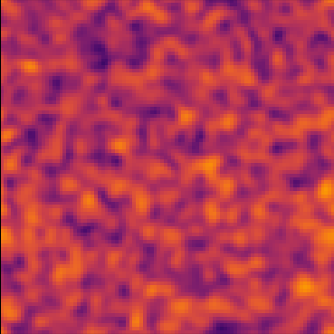
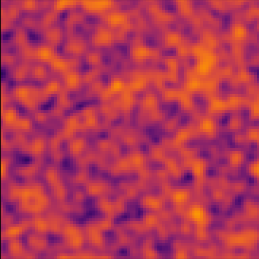
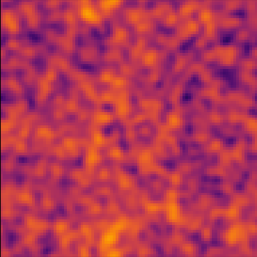
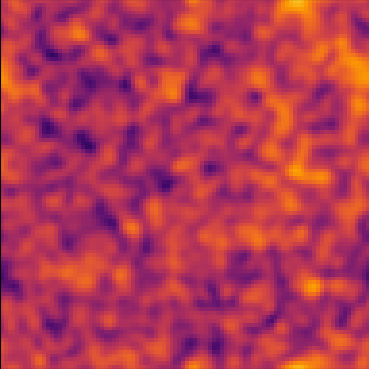
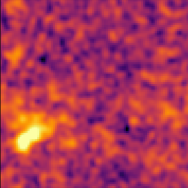

# Kinetic Condensation

Soliton formation in the kinetic regime

Philip Mocz (2025) 

Usage:

```console
python kinetic_condensation.py --res <resolution_multiplier>
```

Takes around 34 (res=1) seconds to run on my macbook (cpu).


## Simulation snapshots

<div style="display:flex;flex-wrap:wrap;gap:8px">
  
  
  
  
  
  
</div>


## Reference

[Levkov, D.G.; Panin, A.G.; Tkachev, I.I.; Gravitational Bose-Einstein condensation in the kinetic regime PRL (2018)](https://ui.adsabs.harvard.edu/abs/2018PhRvL.121o1301L)
