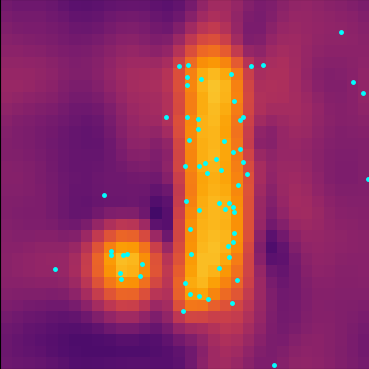

# Logo Inverse Problem

Inverse problem: Find initial conditions for velocity (dm+stars) to achieve target density at t=1

Philip Mocz (2025)

Usage:

```console
python logo_inverse_problem.py
```

Takes around 200 seconds to run on my macbook (cpu).


## Simulation snapshots

<div style="display:flex;flex-wrap:wrap;gap:8px">
  
</div>
