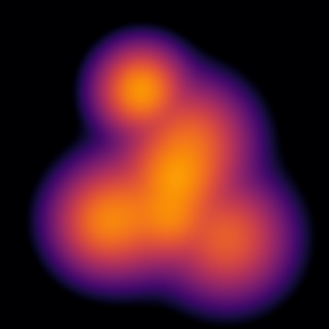
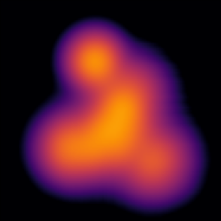
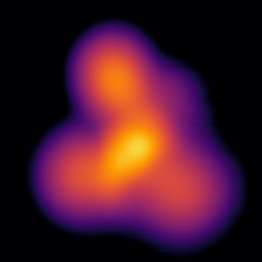
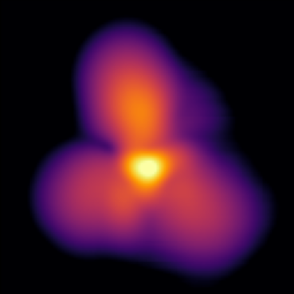
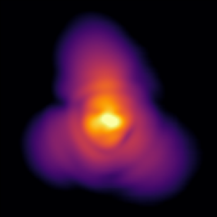

# Merging Solitons

Merge solitons to form an idealized Fuzzy Dark Matter halo

Philip Mocz (2025)

Usage:

```console
python merging_solitons.py --res <resolution_multiplier>
```

Takes around 4 (res=1) seconds to run on my macbook (cpu).


## Simulation snapshots

<div style="display:flex;flex-wrap:wrap;gap:8px">
  
  
  
  
  
  
</div>


## Reference

[Mocz, P. et. al.; Galaxy formation with BECDM - I. Turbulence and relaxation of idealized haloes. MNRAS (2017)](https://ui.adsabs.harvard.edu/abs/2017MNRAS.471.4559M)
