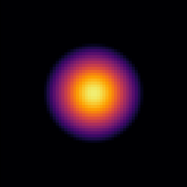
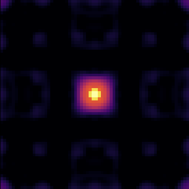

# Self-Interaction Collapse

Collapse a soliton due to attractive self-interaction

Philip Mocz (2025)

Usage:

```console
python self_interaction_collapse.py --res <resolution_multiplier>
```

Takes around 5 (res=1) seconds to run on my macbook (cpu).


## Simulation snapshots

<div style="display:flex;flex-wrap:wrap;gap:8px">
  
  
</div>


## References

[Chavanis, P.H.; Phase transitions between dilute and dense axion stars. Phys. Rev. D. (2018)](https://ui.adsabs.harvard.edu/abs/2018PhRvD..98b3009C)

[Mocz, P. et. al.; Cosmological Structure Formation and Soliton Phase Transition in Fuzzy Dark Matter with Axion Self-Interactions. MNRAS (2023)](https://ui.adsabs.harvard.edu/abs/2023MNRAS.521.2608M)
