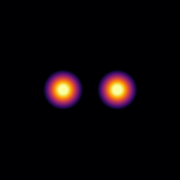
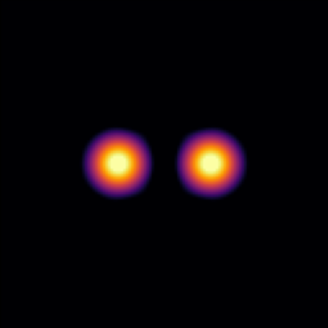
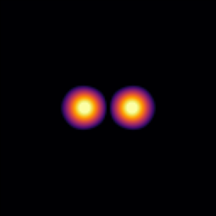
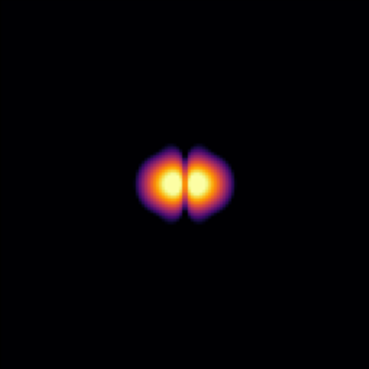
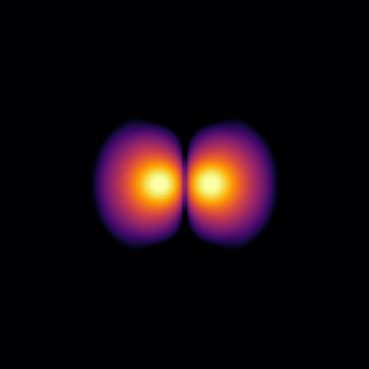
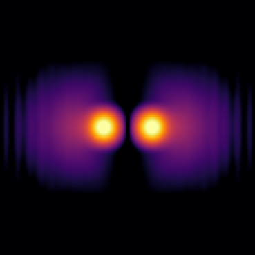

# Soliton Binary Merger

Collide two solitons with opposite phases

Philip Mocz (2025)

Usage:

```console
python soliton_binary_merger.py --res <resolution_multiplier>
```

Takes around 6 (res=1) seconds to run on my macbook (cpu).


## Simulation snapshots

<div style="display:flex;flex-wrap:wrap;gap:8px">
  
  
  
  
  
  
</div>


## Reference

[Schwabe, B.; Niemeyer, J.C.; Engels, J.F.; Simulations of solitonic core mergers in ultralight axion dark matter cosmologies. Phys Rev D. (2016)](https://ui.adsabs.harvard.edu/abs/2016PhRvD..94d3513S)
