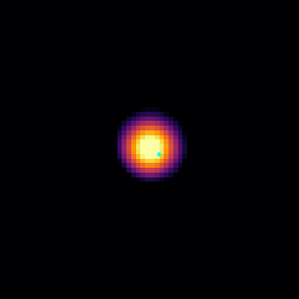

# Soliton Gas Star

Explore the dynamics of a soliton, gas, and single star

Philip Mocz (2025)

Usage:

```console
python soliton_gas_star.py --res <resolution_multiplier>
```

Takes around 20 (res=1) seconds to run on my macbook (cpu).


## Simulation snapshots

<div style="display:flex;flex-wrap:wrap;gap:8px">
  
  
</div>
