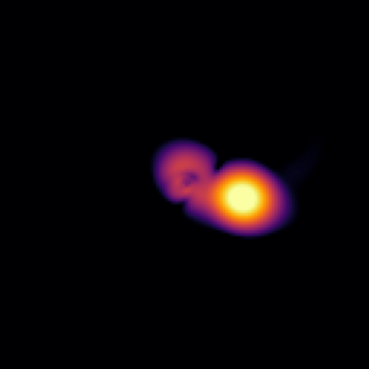
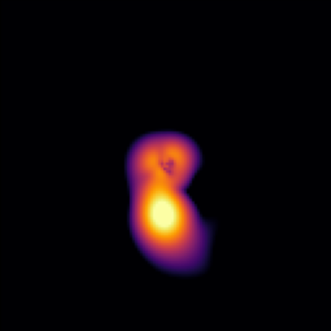
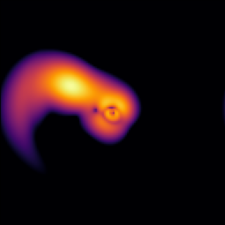

# Tidal Stripping

Tidal Stripping of Fuzzy Dark Matter soliton in an external potential

Philip Mocz (2025)

Usage:

```console
python tidal_stripping.py --res <resolution_multiplier>
```

Takes around 4 (res=1) and 40 (res=2) seconds to run on my macbook (cpu).

Demonstrates adding an external potential, including an imaginary sponge potential to absorb material near the boundaries of the periodic box.


## Simulation snapshots

<div style="display:flex;flex-wrap:wrap;gap:8px">
  
  
  
  
  
  
</div>
