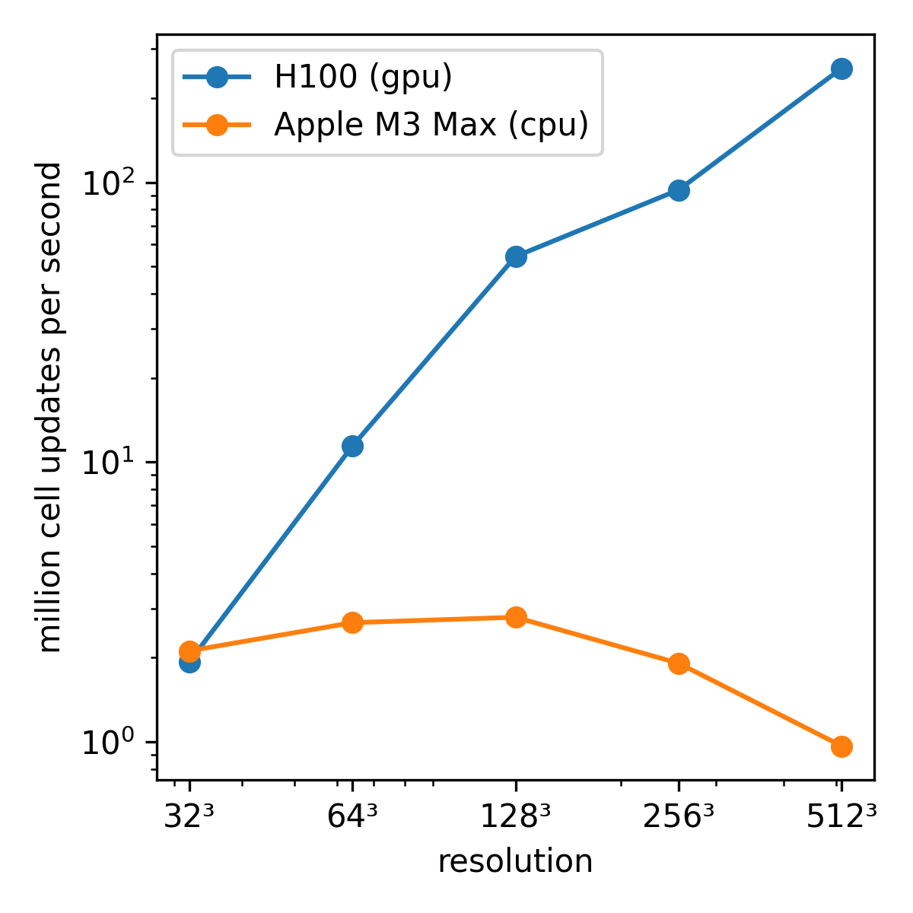

# Heating Gas

Timing test for FDM+hydro based on heating_gas/

Philip Mocz (2025)

Usage:

```console
python timing.py --res <resolution_multiplier>
```

<div style="display:flex;flex-wrap:wrap;gap:8px">
  
</div>
