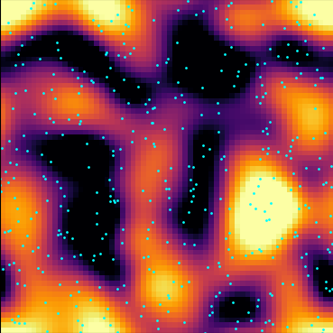
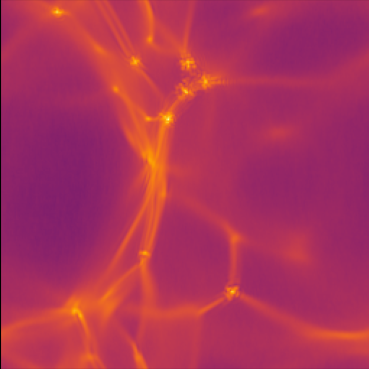

# Summary

We introduce `jaxion`, a Python library built on JAX for 3D numerical simulations of fuzzy dark matter (FDM), gas, and stars.
Spectral, particle-mesh, and finite volume solvers are combined to model the various physics components, which are coupled through gravity.
The code is scalable to multiple GPUs.
JAX's automatic differentiation enables the simulations to be used with optimization and inference workflows.
`jaxion` provides a flexible framework for rapid prototyping at scale and integration of simulations with inverse problems or hybrid physics-ML modeling.

# Statement of need

`jaxion` is designed to be an open-source release of previous research code algorithms that have been used to investigate several aspects of FDM [@Mocz:2017;@Mocz:2018;@Church:2019;@Amin:2019;@Mocz:2019;@Lancaster:2020;@Davies:2020;@Mocz:2020;@Mocz:2021;@Amin:2022;@Dome:2023;@Mocz:2023;@Foote:2023;@Dome:2023;@Luu:2024;@Pozo:2024;@Painter:2024;@Luu:2025;@Pozo:2025]. This new release, written in JAX [@jax2018github], has the added advantage of being differentiable and deployable on multiple GPUs.

Astrophysics research has long relied on sophisticated simulation codes.
Established codes include:
`Athena++` [@Stone:2020],
`Arepo` [@Springel:2010],
`FLASH` [@Fryxell:2000],
`RAMSES` [@Teyssier:2002],
`GAMER` [@Schive:2018],
`PyUltraLight` [@Edwards:2018].
Such codes enable detailed studies of gas dynamics, star formation, cosmological structure formation, and galaxy evolution. These tools employ a combination of grid-based, particle-based, and spectral methods to solve the governing equations of hydrodynamics, gravity, and additional physics.

Despite their successes, classical astrophysics codes are limited in their ability to interface with modern machine learning (ML) frameworks and support automatic differentiation. As ML and AI techniques are becoming more integrated with scientific fields, e.g. for parameter inference, model discovery, and hybrid physics-ML modeling, there is a growing need for simulation frameworks that are flexible and differentiable.
`jaxion` fills this gap, by leveraging automatic differentiation, hardware acceleration, and seamless integration with ML workflows. Other recent developments of differentiable astrophysics code for various applications ranging from hydrodynamical simulations to modeling gravitational waves include [@Horowitz:2025;@Lanzieri:2022;@Wong:2023]

`jaxion` is a differentiable simulation library specifically designed for studying FDM coupled to baryons (stars and gas). FDM is a plausible dark matter candidate, modeled as a quantum wave-like field. It exhibits unique phenomena such as solitonic cores and granular interference patterns on kiloparsec scales [@Hui:2017]. `jaxion`, with built-in automatic differentiability, is aimed to open new avenues for scientific discovery through gradient-based parameter inference, optimization, and hybrid physics-ML modeling.

# Overview of functionality

`jaxion` solves the following equations:

| Component         | Governing Equations             | Numerical Method |
|-------------------|---------------------------------|------------------|
| Fuzzy Dark Matter | Schrodinger-Poisson             | Spectral         |
| Gas               | Compressible Euler (isothermal) | Finite Volume    |
| Stars             | Collisionless N-body            | Particle-Mesh    |
| Gravity           | Poisson equation                | Spectral         |

in a 3D periodic domain. It can solve equations in physical or comoving (cosmological) coordinates. Users can additionally optionally add an external potential. Features will continue to expand in future releases, including self-interactions, multiple axion fields, other fluid equations of state, and sink particles.

The code generates checkpoints (for restart and analysis) and images.

Documentation is found at: https://jaxion.readthedocs.io/

The Github Repository is at: https://github.com/JaxionProject/jaxion

Examples of simulation setups are found in the `examples/` directory, including inverse problems (optimization).

Below are snapshots from some of the examples:

| | | |
|-|-|-|
|  |  |  |

# Acknowledgements

We acknowledge discussions with researchers over the past decade which led to an initial implementation of FDM solvers,
refinement and several publications over the years, and ultimately the development of this Python package. Thanks are due to:
Mustafa A. Amin,
Fernando Becerra,
Gurtina Besla,
Sownak Bose,
Michael Boylan-Kolchin,
Pierre-Henri Chavanis,
Benjamin V. Church,
Elliot Yarnell Davies,
Tibor Dome,
Razieh Emami,
Elisa G. M. Ferreira,
Anastasia Fialkov,
Hayden R. Foote,
Cara Giovanetti,
Frank Graziani,
Benjamin Hamm,
Lars Hernquist,
Lam Hui,
Lachlan Lancaster,
Alvaro Pozo Larrocha,
Mariangela Lisanti,
Eric Ludwig,
Hoang Nhan Luu,
Tina Kahniashvili,
Federico Marinacci,
Simon May,
Jens C. Niemeyer,
Matthew Notis,
Jerry Ostriker,
Connor A. Painter,
Victor H. Robles,
Bodo Schwabe,
Xuejian Shen,
Martin Sparre,
David Spergel,
Volker Springel,
Sauro Succi,
Hy Trac,
Scott Tremaine,
Mark Vogelsberger,
Jesus Zavala.

# References

